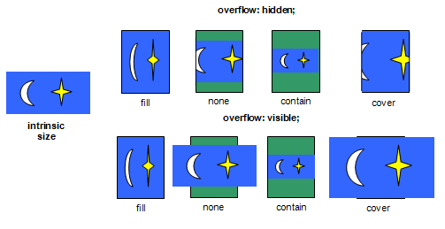

# laravel helpers

Set of often used assistants

### Corundum (SDK)

Corundum (SDK) is a set of adapters which are able to change the image sizes by rules: fit, none, cover, contain, resize.



```php
$slice = new \Bavix\Slice\Slice([
    'disk'   => 'public',
    'driver' => 'gd'
]);

$corundum = new \Bavix\Helpers\Corundum\Corundum($slice);
$adapter  = new \Bavix\Helpers\Corundum\Adapters\Contain(
    $corundum,
    __DIR__ . '/images/test.png'
);

$slice = new Bavix\Slice\Slice([
    'width'  => '600',
    'height' => '600',
    'color'  => '#f00'
]);

$adapter->apply($slice)
    ->save(__DIR__ . '/images/none.png');
```

### Model URL

```php
use Bavix\Extensions\ModelURL;

class File extends Model
{
    use ModelURL;
    
    protected $route = 'file';
    
    // ...
}
```
